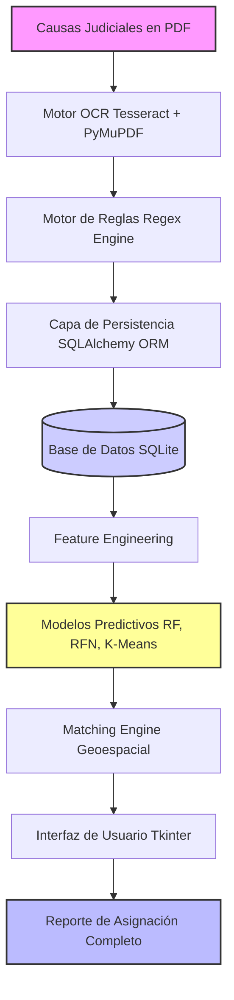

Markdown
# ⚖️ Sistema Inteligente de Análisis y Asignación de Programas (Adultos Mayores)

### **Proyecto de Memoria de Título | Ingeniería Civil en Informática y Telecomunicaciones**
*Universidad Finis Terrae, 2025*

---

## 🚀 La Problemática

El proyecto aborda un desafío crítico en la gestión pública: la transformación de datos **no estructurados** (causas judiciales en formato PDF) en información accionable. Este sistema automatiza la extracción de texto mediante OCR, evalúa el riesgo patrimonial y asigna eficientemente a los adultos mayores a los programas sociales de la red estatal.

---

## 📊 Arquitectura del Sistema (Data Pipeline)

A continuación, se presenta el flujo lógico del pipeline de datos y el motor analítico desarrollado. GitHub renderiza este diagrama automáticamente:

# ⚖️ Sistema Inteligente de Análisis y Asignación de Programas (Adultos Mayores)

### **Proyecto de Memoria de Título | Ingeniería Civil en Informática y Telecomunicaciones**
*Universidad Finis Terrae, 2025*

---

## 🚀 La Problemática

El proyecto aborda un desafío crítico en la gestión pública: la transformación de datos **no estructurados** (causas judiciales en formato PDF) en información accionable. Este sistema automatiza la extracción de texto mediante OCR, evalúa el riesgo patrimonial y asigna eficientemente a los adultos mayores a los programas sociales de la red estatal.

---

## 📊 Arquitectura del Sistema (Data Pipeline)

A continuación, se presenta el flujo lógico del pipeline de datos y el motor analítico desarrollado. GitHub renderiza este diagrama automáticamente:

# ⚖️ Sistema Inteligente de Análisis y Asignación de Programas (Adultos Mayores)

### **Proyecto de Memoria de Título | Ingeniería Civil en Informática y Telecomunicaciones**
*Universidad Finis Terrae, 2025*

---

## 🚀 La Problemática

El proyecto aborda un desafío crítico en la gestión pública: la transformación de datos **no estructurados** (causas judiciales en formato PDF) en información accionable. Este sistema automatiza la extracción de texto mediante OCR, evalúa el riesgo patrimonial y asigna eficientemente a los adultos mayores a los programas sociales de la red estatal.

---

## 📊 Arquitectura del Sistema (Data Pipeline)

A continuación, se presenta el flujo lógico del pipeline de datos y el motor analítico desarrollado. GitHub renderiza este diagrama automáticamente:

🛠️ Capacidades de Ingeniería de Datos
1. Procesamiento de Datos No Estructurados (OCR)
Motor Híbrido: Combinación de PyMuPDF para manipulación de documentos y Tesseract OCR para digitalización de alta precisión en textos legales complejos.

Normalización: Algoritmos de limpieza para reducir el ruido en textos escaneados y mejorar la tasa de acierto del Parsing.

2. Motor de Reglas Avanzado (Regex Engine)
Extracción de Entidades: Diseño de expresiones regulares para identificar patrones de riesgo biográfico y patrimonial.

Pattern Matching: Automatización en la extracción de variables clave (RIT, comunas, fechas) para el modelado estructurado.

3. Machine Learning Pipeline
Feature Engineering: Transformación de texto procesado en vectores de características para el modelado predictivo.

Modelado: Entrenamiento y evaluación de algoritmos con Scikit-Learn:

Random Forest (Clasificación de Riesgo)

Redes Neurales (Clasificación Profunda)

K-Means (Clustering de Vulnerabilidad)

💻 Stack Tecnológico
Nota de Ingeniería: Se utilizó SQLAlchemy como capa de abstracción (ORM) para asegurar un código mantenible, facilitar futuras migraciones a motores como PostgreSQL y garantizar la integridad referencial de los datos.

🔧 Instalación y Ejecución
Para replicar el entorno de desarrollo y ejecutar el sistema:

Clonar el repositorio:

Bash
git clone [https://github.com/Bastian-SotoM/Nombre-De-Tu-Repositorio.git](https://github.com/Bastian-SotoM/Nombre-De-Tu-Repositorio.git)
Instalar dependencias:

Bash
pip install -r requirements.txt
Configurar OCR:
Asegúrese de tener instalado Tesseract OCR en su sistema y agregarlo al PATH de variables de entorno.

Ejecutar aplicación:

Bash
python main.py
