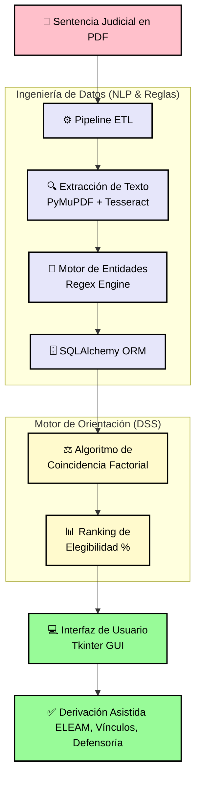

# ⚖️ Sistema de Orientación Judicial: Derivación Asistida de Adultos Mayores

### **Trabajo de Título | Ingeniería Civil en Informática y Telecomunicaciones**
*Universidad Finis Terrae, 2025*

---

## 🚀 Resumen del Proyecto

Este proyecto desarrolla un prototipo de **Sistema de Soporte a la Decisión Judicial (DSS)** diseñado para abordar el maltrato patrimonial en adultos mayores en Chile.A diferencia de los modelos de "caja negra", este sistema utiliza un **Análisis de Coincidencia Factorial** para transformar sentencias judiciales no estructuradas en sugerencias de derivación técnica hacia la oferta programática estatal como SENAMA y redes municipales.

---

## 📊 Arquitectura del Sistema (Data Pipeline)

El software implementa un flujo automatizado desde la ingesta del documento legal hasta la recomendación de una medida de protección social. El diagrama a continuación presenta un **alto contraste** para una lectura óptima en GitHub:


## 🛠️ Capacidades Técnicas Desarrolladas

### 1. Procesamiento de Información No Estructurada
- **Pipeline ETL Automatizado:** Extracción masiva de datos desde archivos PDF (nativos y escaneados) utilizando las librerías `PyMuPDF` y `Tesseract OCR`.
- **Reconocimiento de Entidades (Regex):** Implementación de un motor de expresiones regulares para identificar metadatos críticos como RIT, tribunales y variables biopsicosociales.

### 2. Motor de Coincidencia (Matching Engine)
- **Lógica Ponderada:** El sistema utiliza una escala discreta $\{-2, -1, +1, +2\}$ para diferenciar matemáticamente los requisitos obligatorios de los factores agravantes de contexto.
- **Gestión de Incertidumbre:** Ante la falta de datos clave en la sentencia, el sistema penaliza el "Nivel de Confianza" y genera alertas de información faltante para orientar la indagación del juez.
- **Filtro de Territorialidad:** El sistema valida la viabilidad de la sugerencia según la disponibilidad real de programas en la comuna del usuario (ej. convenios SNAC o CEDIAM).

### 3. Seguridad y Auditoría
- **Control de Acceso (RBAC):** Interfaz adaptativa que distingue entre los roles de **Analista** y **Administrador**.
- **Trazabilidad Forense:** Registro inmutable de todas las operaciones críticas (logins, cargas, modificaciones) en una tabla de auditoría para asegurar la transparencia institucional.

---

## 💻 Stack Tecnológico


> **Nota de Ingeniería:** Se priorizaron los **Sistemas Basados en Reglas** sobre modelos predictivos complejos ("caja negra") para asegurar la transparencia ética y la explicabilidad, requisitos fundamentales en el dominio de los Derechos Humanos y la justicia.

---

## 🔧 Instalación y Ejecución

1. **Clonar el repositorio:**
   ```bash
   git clone https://github.com/Bastian-SotoM/legal-document-etl-pipeline.git
2. Instalar dependencias:
```bash
pip install -r requirements.txt
```
3. Configurar Tesseract OCR:
Asegúrese de que el motor de Tesseract esté instalado en su sistema operativo y agregado al PATH de las variables de entorno.
4. Ejecutar aplicación:
```bash
python main.py
```
Desarrollado por Bastián Soto Morales - Ingeniero Civil en Informática y Telecomunicaciones, Universidad Finis Terrae.
